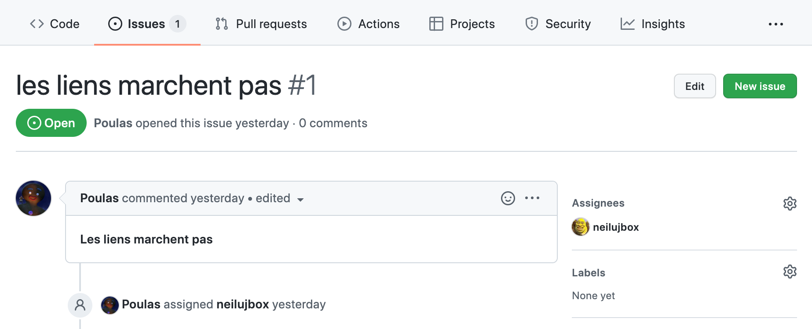
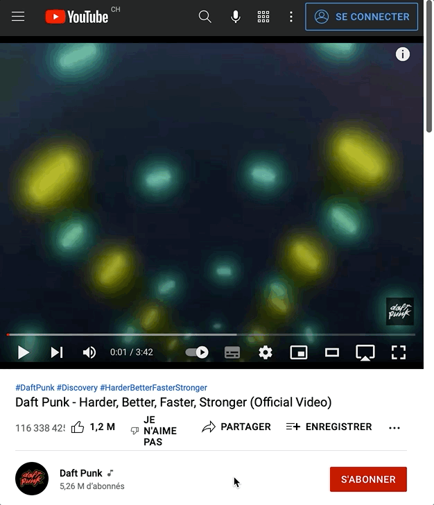

Cours du 30 mars.

Déroulement:

- 5 minutes de révision Podsie 🧠 (nouvelles questions sur Git)
- Création par chaque élève de deux "Issues" pour le challenge #5. Chaque élève va devoir s'attribuer un challenge d'un autre élève et le résoudre.
- Informations sur le sujet du jour: la vidéo sur le web.

## Sur la création des Issues sur Github

Les "Issues" sont une manière de communiquer autour d'un projet Github. On crée des issues pour: des bugs, des fonctionalités à ajouter, des besoins d'utilisateurs.

Un contributeur peut s'attribuer une "Issue". On peut faire des commentaires.

Voici [un exemple](https://github.com/eracom-ID401/Site-Skateb-b--Thomas/issues/1):



## Les essentiels de la vidéo sur le web

Deux manières d'intégrer de la vidéo:

### 1) En HTML, avec une balise `<video>`

Un exemple:

```html
<video width="100%" height="auto" controls controlsList="nodownload" poster="video/personal-letter.jpg">
  <source src="video/personal-letter.mp4" type="video/mp4">
</video>
```

Comme on le voit, l'élément HTML `<video>` prend plusieurs attributs (par exemple `poster` pour définir l'image affichée avant la lecture).

Elle contient une balise `<source>` qui indique le fichier vidéo.

[L'article MDN donne plus d'explications](https://developer.mozilla.org/fr/docs/Web/HTML/Element/video), ainsi que la liste des attributs disponibles.

### 2) Depuis une plateforme comme Youtube, Vimeo...

Ces services d'hébergements permettent d'intégrer une vidéo avec un code. Il faut cliquer sur *Share* (*Partager*), puis choisir *Embed* (*Intégrer*).



Voici un exemple de code pour une vidéo Youtube:

```html
<iframe width="560" height="315" src="https://www.youtube.com/embed/68iQAo2XXtE" title="YouTube video player" frameborder="0" allow="accelerometer; autoplay; clipboard-write; encrypted-media; gyroscope; picture-in-picture" allowfullscreen></iframe>
```

### Rendre la vidéo responsive

On voit dans cet exemple que cette vidéo a une taille fixe, en hauteur et largeur (560 sur 315 pixels).

Il est possible de rendre ce code totalement responsive en l'éditant de la manière suivante: 

```html
<iframe width="100%" style="aspect-ratio: 16 / 9;" src="https://www.youtube.com/embed/68iQAo2XXtE" title="YouTube video player" frameborder="0" allow="accelerometer; autoplay; clipboard-write; encrypted-media; gyroscope; picture-in-picture" allowfullscreen></iframe>
```

Les changements:

- On a remplacé l'unité de largeur par 100%.
- On a supprimé l'unité de hauteur, et on a appliqué le style CSS `aspect-ratio: 16 / 9`.

Voir [la référence MDN Web Docs sur la propriété aspect-ratio](https://developer.mozilla.org/fr/docs/Web/CSS/aspect-ratio). C'est une propriété CSS récente supportée par les navigateurs depuis 2021.

## Ressources vidéo

Des sources de fonds vidéo ("royalty-free background videos") pour site web:

- [Pexels](https://www.pexels.com/search/videos/background/)
- [Videezy](https://www.videezy.com/free-video/background)
- [Mixkit](https://mixkit.co/free-video-backgrounds/)
- [Coverr](https://coverr.co/)

## Les *Working Agreements*

En fin de séance, les élèves ont consacré 5 minutes à développer les mots-clés notés durant la séance de travail du 23 mars autour de Git (*communication, organisation, coopération, écoute, respect d'autrui*), pour en faire des "Working Agreements".

➡️ Lire la page [Working Agreements](working-agreements.html).
