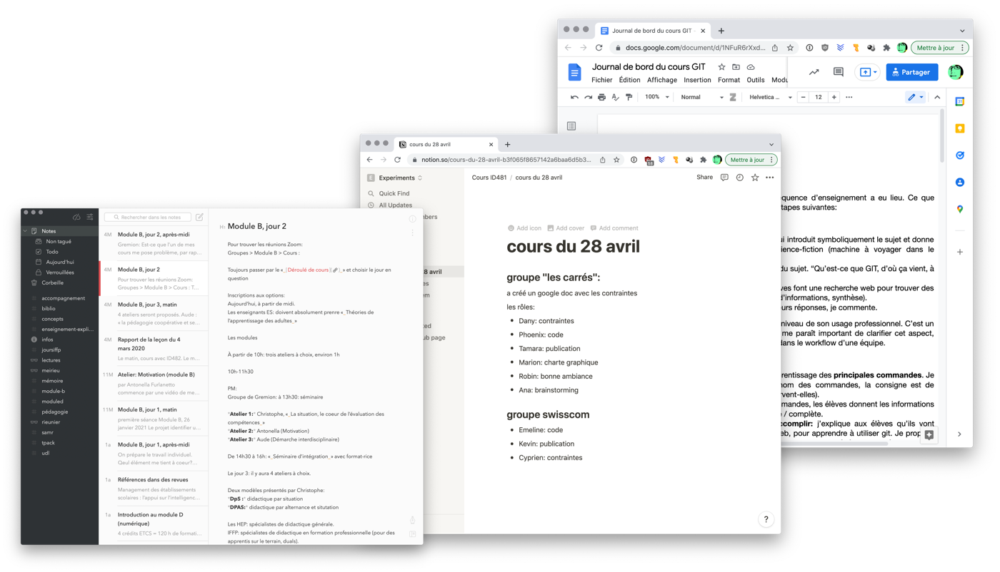

Trois évaluations seront réalisées au courant du semestre. Chaque évaluation portera sur trois aspects:

- **Réaliser les challenges techniques** proposés à chaque cours. (1/3)
- Un **Test théorique**, qui reprend les questions des quiz de révision hebdomadaires sur Podsie.  (1/3)
- **Tenir une documentation personnelle** (une page avec des liens et exemples de code, sur Replit, Codepen, etc).  (1/3)

## 1) Les challenges

Un challenge peut être "réalisé" ou "non-réalisé", sans nuance qualitative. Chaque challenge réalisé donne un point.

## 2) Test théorique

Ce test reprend certaines questions des quiz de révision publiés chaque semaine sur [Podsie](podsie.html).

## 3) Documentation personnelle

Un journal de bord personnel, dans lequel vous collectez les liens des Challenges, des exemples de code, des questions que vous vous posez. Vous devez m'envoyer cette documentation (ou un lien qui donne accès), par la messagerie Teams. Si vous utilisez Notion, veillez à [activer le partage public du document](img/share-notion.gif) ("share to web").

 

## Calcul de la note

Lors de l'évaluation du 9 mars 2022, le calcul se fait sur 32 points (12 pour les challenges, 12 pour le test théorique, 8 pour la documentation).

| Points obtenus      | Note |
|:------------------- |:---- |
| 31-32               | 6    |
| 28-30               | 5,5  |
| 24-27               | 5    |
| 21-23               | 4,5  |
| 18-20               | 4    |
| 15-17               | 3,5  |
| 12-14               | 3    |