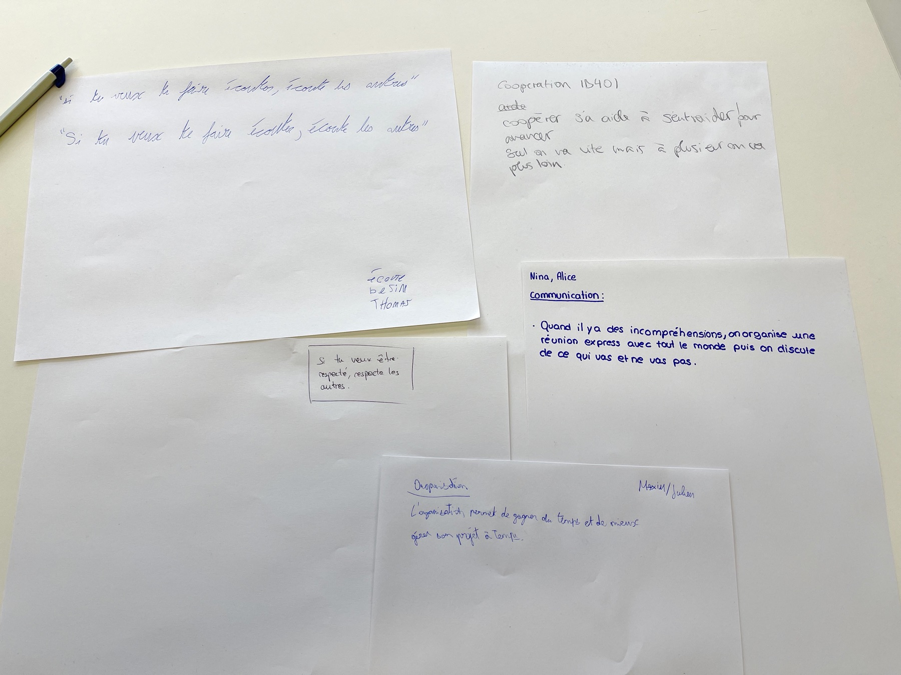

## Les *Working Agreements*

Pendant la séance de travail du 23 mars 2022 autour de Git, les équipes ont produit cinq mots-clé: *communication, organisation, coopération, écoute, respect d'autrui*. Ces termes représentent des valeurs importantes pour une équipe de travail.

La proposition est de développer, à partir de ces mots, des "working agreements". En français, ce terme est traduit par "Accord de travail pour une équipe". 

Dans la méthodologie de travail Agile, il est très recommandé qu'une équipe détermine en début de projet ses "Working Agreements" et les mette par écrit. Cela pose un cadre de fonctionnement, et permet de réagir à des actions qui iraient à l’encontre de ces accords.

Voilà [un exemple de document-type](https://wikiagile.cesi.fr/index.php?title=Canevas_d%27Accord_de_Travail_pour_une_%C3%89quipe) pour mettre les accords par écrit.

## Les phrases développées le 30 mars

- **Communication** - Quand il y a des incompréhensions, on organise une réunion express avec tout le monde puis on discute de ce qui ne va pas.
- **Organisation** - L'organisation permet de gagner du temps et de mieux gérer son projet à temps.
- **Coopération** - Coopérer ça aide à s'entraider pour avancer. Seul on va vite mais à plusieurs on va plus loin.
- **Écoute** - Si tu veux te faire écouter, écoute les autres.
- **Respect d'autrui** - Si tu veux être respecté, respecte les autres.

Nous pourrons lors d'une prochaine séance valider ces propositions, et les affiner si nécessaire.

